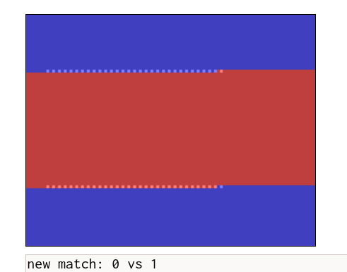

# Research Journal 01: Core Wars

William Findlay
Sept. 15, 2020

## First Article

Core War is probably one of the coolest things I have seen in a very long time.
The idea is simple enough: two processes battling for control of a virtual
machine, each one trying to cause the other to encounter an exception and die;
what is remarkable to me about Core War is that its apparent simplicity belies
a deeply intricate and complex game of strategy beneath the surface. The idea of
programs fighting to the death in a battle arena implies that the fittest
program must survive --- a crude form of natural selection arises where
selective pressure comes from the desires of human programmers to win the
battle. Although Redcode is only a simple assembly-like language on the surface,
it offers a rich and diverse solution space for such programs to be defined.

I was so intrigued by CoreWar that I had to try it myself, which I did at this
link: https://crypto.stanford.edu/~blynn/play/redcode.html While I wasn't able
to beat either the MICE or the CHANG1 programs, I found I was able to grasp many
of the core concepts and "design patterns" that were discussed in the article.
By "design patterns" I am of course referring to common constructs that seem to
show up in many CoreWar programs and are known to produce interesting or useful
results. One example of such a design pattern, the IMP-GUN (spl 2; jmp -1; mov
0 1), allows you to continually launch a barrage of killer programs into
a neighboring address space. The simulation at the above URL provides
a visualization of the resulting programs in operation, and it is definitely
cool to see your IMPs being fired into enemy territory in real time. In a way,
patterns like the DWARF, IMP, IMP-GUN, and IMP-STOMPER are similar to the
analogous structures we see between populations in biology --- the useful
blueprints tend to show up time and time again.

The GIF above shows my two IMP-GUNs racing across the battlefield. Curiously,
a pattern emerges where each side's "bullets" chase the enemy's main program
indefinitely, never quite catching up to it.

Towards the end of the article, Dewdney discusses potential improvements to
CoreWar, including a new PCT instruction that would prevent an address from
being overwritten until it is next executed. This would provide programs with
a way to defend themselves from crude guessing attacks that involve bombing
distance addresses with 0s. However, I noted that this capability could also be
used offensively against programs that copy themselves from location to
location. The PCT instruction could cause holes in the resulting copy and thus
interfere with the enemy's execution.

## Second Article

The very first thing I need to mention here is that at least two other people
had the same idea as I did for using the proposed PCT instruction in an
offensive manner (see above). Perhaps an interesting takeaway here is that users
can often find unintended ways to abuse systems, regardless of the creator's
intentions. Abstracting this concept and applying it to modern software systems
perfectly illustrates both the cat-and-mouse game that is security and why an
adaptive solution might be necessary to ensure the security and stability of our
systems going forward (as both attacks and defenses grow increasingly complex).

Aside from a few brief moments revisiting the mechanics of CoreWar (essentially
re-hashing the first article), the rest of the article focuses primarily on
real-world attacks and defenses and the common themes therein that often
resurface in the CoreWar simulation itself. There is a lot to be said here and
I have a lot more thoughts on this, so that will be my focus for the rest of
this entry.

Of particular interest to me was the description of a CoreWar-like sumulation
that involved random mutations of programs, "Left Hand of God" by Stahl. This
simulation sounds like a more simplistic and earlier version of the Tierra
project (next week's reading). Unfortunately, it seems like the simulation was
slightly too simplistic for its own good, producing no interesting results.
I would be curious to find out whether "Left Hand of God" was an early
inspiration for the Tierra work (it certainly seems that at least CoreWar played
a significant role).

The "Animal" game is an interesting example of an otherwise benign program
ruined by a terrible design choice. Such a program today would almost certainly
be considered malware (although accidentally writing such a program would also
be at least much more difficult if not impossible given the protection
constraints imposed by modern operating systems). Indeed, a common theme among
the early examples of malware discussed in this article is that many of them
were made possible by an utter lack of protection in the host operating systems.
For instance, the Apple Worm exploited the fact that the Apple II offers very
little memory protection, imposing no limited address space for a running
program and zero separation between userspace and kernelspace.

It was also interesting to see a very early example of a well-known attack, the
fork bomb, arise out of a benign (albeit incredibly silly) programming error.

## Third Article

It's cool to see CoreWar programs being designed to mimic behavioral patterns
from the real world, such as COMMANDO which vaults into enemy territory to
launch a sneak attack or MICE (the winner of the tournament) which reproduces
like, well, mice. Here again we see several common patterns emerging among the
most successful battle programs. While battle programs have not yet reached the
level of sophistication proposed in the first article, they are certainly
formidable and resilient despite the fact that the most successful ones are
fewer than 12 lines in length.

I absolutely loved reading the description of the battle between MICE and
CHANG1. Especially since I could *watch* the battle in real time thanks to the
CoreWar simulator linked above.

## Fourth Article

Kind of disappointing to hear about the media blaming CoreWar for contemporary
viruses and worms. Really, the concept of malicious programs existed long before
CoreWar and is rather symptomatic of poor security practices at the time. If
anything, exercises like CoreWar help to illustrate the complexity of defending
against attacks, especially in insecure environments, and bring awareness to the
fact that people need to a bit more careful when deploying software in
production.

Of course, the mystery worm discussed in the article is the venerable Morris
worm, a piece of literal computing history. The Morris worm appears to suffer
from a similar fatal flaw to the Animal game discussed in the first article,
albeit much larger in scale; despite being designed as a "benign" (certainly
debatable) intellectual exercise, an improperly configured spread coefficient
led to its virulent consumption of global computing resources. Spaf sums it up
quite nicely in suggesting that Morris should have tested his re-infection
coefficient in a simulation first. Unfortunately, the exponential nature of
the Morris worm's infection vector means that even a 1/7 chance for reinfection
can be crippling in practice.

## Random Thoughts

- This is absolutely hilarious: "I abandoned this line of work after one production run in which a sterile mutant ate and killed the only fertile creature in the universe."
- Interesting how many attacks and defenses have survived in one form or another from the early descriptions in the second article
    - Also interesting to see how much more damage these attacks could do back when systems had basically no protection
    - For example Apple II had no user/kernelspace separation, so a worm written in BASIC and assembly could just wipe the entire DOS

## Early Project Notes

- Thinking about doing something with eBPF, but what?
    - More BPF LSM programs? (been there, done that --- but there is still a lot of low hanging fruit here, even from an adaptive security perspective)
    - Perf events? Could be some really cool opportunities for modeling system behavior here... This would certainly be uncharted  territory, but there could be overhead concerns depending on sampling frequency
    - Maybe some kind of network IDS that learns patterns in traffic? I have less experience here but it could be nice to try something different for a change
- So far I've just been working on some preliminary experiments/brainstorming with different BPF programs, hoping to see what sticks
